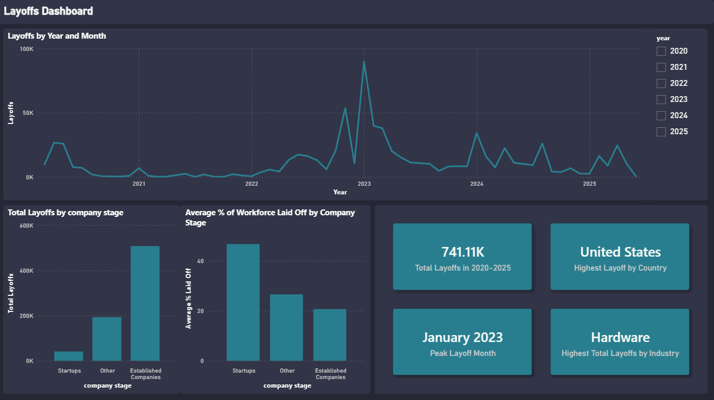

# Exploratory Data Analysis: Tech Layoffs Dataset



## Overview
This project analyzes a dataset of global tech layoffs to uncover trends in **when**, **where**, and **how severely** companies were affected. It follows a completed data cleaning phase (https://github.com/Erollercoaster/layoffs-data-cleaning) and focuses on exploratory data analysis (EDA) using PostgreSQL, with findings visualized in Power BI connecting directly to the PostgreSQL database.

## Dataset
**Dataset:** [Layoffs 2022 — Kaggle](https://www.kaggle.com/datasets/swaptr/layoffs-2022)  

## Tools & Techniques
- PostgreSQL
- Power BI Desktop
- DAX (calculated columns, measures, dynamic titles)
- Aggregate functions (`SUM`, `AVG`)
- Date functions (`EXTRACT`, `DATE_TRUNC`)
- Window functions (`DENSE_RANK`, `PARTITION BY`)
- CTEs for multi-step aggregation
- `CASE` statements for categorization
- `information_schema` for schema inspection

---

## Pipeline

```
layoffs_clean (PostgreSQL)
    ↓
SQL Reporting Views (pre-aggregated BI layer)
    ↓
Power BI (connected directly to PostgreSQL via Import mode)
```

---

## Initial Exploration

Before diving into specific questions, the dataset was inspected to understand its structure and boundaries:

- Checked column names, data types, and nullability via `information_schema.columns`
- Established the overall date range of the dataset: 2020-03-11/2025-06-04

---

## Key Questions & Findings

### 1. Which sectors were hit hardest?
**Finding:** By total headcount, Hardware was the most affected sector (81,428 layoffs). However, when looking at the average percentage of workforce cut, Aerospace companies were proportionally hit hardest (45.4% on average) despite contributing relatively little to the overall total — suggesting that while fewer aerospace companies underwent layoffs, those that did made severe cuts.

---

### 2. Which countries were most affected?
**Finding:** The United States accounted for the largest share of total layoffs at 505,536. The top 10 countries account for the overwhelming majority of total layoffs; the remaining 39 countries combined contribute a comparatively small share.

---

### 3. When did this peak?
**By year:** 2023 was the peak year with 264,220 total layoffs, followed by 2022 with 164,319.

**By month:** January 2023 was the single worst month across the full dataset, with 89,709 layoffs.

---

### 4. Were startups hit harder than established companies?
**Finding:** Startups (Seed-Series B) lost an average of **46.65%** of their workforce per layoff event, compared to **20.67%** for established companies (Post-IPO, Acquired, Private Equity) - despite established companies accounting for far more total layoffs in raw numbers (507,469 vs 41,010).

> **Note:** Growth-stage companies (Series C-F) were grouped under "Other" to keep the startup vs. established comparison clean, as they represent a transitional category that could skew results in either direction.

---

### 5. Which 5 companies laid off the most in each year?
**Finding:** The top 5 companies by year reveal a shift from startup/gig-economy layoffs in 2020-2021 (Uber, Booking.com, Bytedance) to sustained large-scale cuts at established tech giants from 2022 onward. Several companies — Meta, Amazon, Cisco, Microsoft, and Intel — appear in the top 5 across multiple years, suggesting repeated rounds of restructuring rather than one-off events. Intel's 2025 total of 22,058 stands out as the single largest annual layoff figure in the dataset.

---

## Reporting Views

Rather than exporting results to CSV or rebuilding aggregation logic inside Power BI, each EDA finding was materialized as a SQL view directly in PostgreSQL. Power BI connects to these views in Import mode, keeping all transformation logic version-controlled in SQL and maintaining a clean separation between the data layer and the presentation layer.

| View | Answers |
|---|---|
| `view_industry_impact` | Which sectors were hit hardest by total headcount and average % of workforce cut |
| `view_country_impact` | Which countries were most affected (top 10 by total layoffs + Other grouping) |
| `view_yearly_monthly_totals` | Monthly layoff totals across the full 2020–2025 date range |
| `view_stage_comparison` | Whether startups or established companies were proportionally more affected |
| `view_top5_companies_by_year` | Top 5 companies by total layoffs per year using `DENSE_RANK() OVER(PARTITION BY year)` |

---

## Data Quality Notes
- `percentage_laid_off` is stored as a whole number (e.g. `46.65`) rather than a decimal — confirmed by checking raw values before aggregating to avoid inflated results.
- Rows with `NULL` values for `total_laid_off` were excluded from sum-based calculations where relevant.
- Country grouping in `view_country_impact` uses `DENSE_RANK()` to dynamically identify the top 10 countries; remaining countries are bucketed as `Other` and represent 39 countries combined.

---

## Repository Structure
```
exploratory-data-analysis/
├── README.md
├── scripts/
│   ├── 01_eda.sql
│   └── 02_reporting_views.sql
└── dashboard/
    └── layoffs_dashboard.pbix
```

---

## Lessons Learned
- Learned the difference between `EXTRACT` and `DATE_TRUNC` and when each is appropriate for date-based aggregations.
- Practiced building multi-layer CTEs by validating each aggregation step independently before stacking window functions on top.
- Caught a data formatting issue (`percentage_laid_off` stored as a whole number) before it skewed analysis results.
- Built SQL reporting views as a dedicated BI layer, keeping transformation logic in PostgreSQL rather than rebuilding it in Power Query or DAX.
- Applied `DENSE_RANK() OVER(PARTITION BY year)` to rank companies within each year, then used a visual-level filter in Power BI to surface only the top N without creating separate queries per year.
- Learned the practical difference between Import and DirectQuery modes and when each is appropriate for a given dataset.
- Applied the principle of separating concerns across the pipeline: raw data, cleaned data, reporting views, and presentation layer each serving a distinct purpose.
